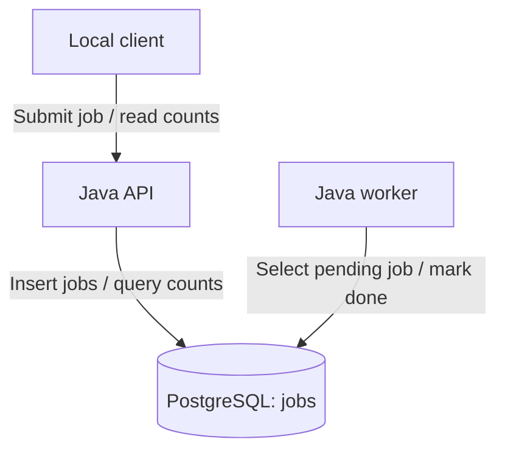

# AI-Assisted DevSecOps Security Pipeline

**Live Demo:** https://ai-assisted-devsecops-security-pipeline.onrender.com

**Pipeline Status:** 

## Executive Summary

An educational DevSecOps project built around a Java API, a background
worker, and PostgreSQL. The API stores submitted jobs, and the worker
simulates processing by changing their status from pending to done.

The repository includes workflows for automated tests, security scans,
software inventory, and container publishing and signing. Coverage varies
by workflow; checks for the earlier single-container application must be
distinguished from checks for the API and worker stack.

A separate AI triage script uses Groq to review CodeQL findings and
available source-code context. Its output is advisory and requires human
review.

## Validation Scope

- Application code implements job submission, database storage, and a
  worker that marks pending jobs done.
- The current MultiServiceIntegrationTest checks database connectivity,
  job insertion, and aggregate status counts.
- That test does not call the HTTP API, execute the worker, or verify
  completion of the specific submitted job.
- Complete container-stack testing and separate security reports and
  SBOMs for both images are Phase 2 objectives.
- Historical scan results below apply only to their documented runs
  and targets.
- Financial savings, faster remediation, and reduced incident rates
  have not been measured in this lab.

## AI Data Sharing

When findings are present and the script executes successfully, it sends
up to 10 CodeQL findings and available surrounding source-code context
to Groq. Results are posted to a pull request when a PR number is
available; otherwise, they are printed to workflow output.

A run with no findings does not validate AI classification accuracy.
AI classifications do not automatically fix code or dismiss findings.

## Feature Status

**Implemented:** Code or configuration exists.
**Tested — historical:** Results were recorded for a specific earlier run.
**Planned:** Implementation or validation remains outstanding.

| Capability | Status | Current coverage |
|---|---|---|
| Java API and PostgreSQL storage | Implemented | Accepts jobs and returns aggregate status counts |
| Background worker | Implemented | Simulates processing by marking pending jobs done |
| API and worker image builds | Implemented | Both images have build steps in CI |
| Database integration test | Implemented | Checks connectivity, insertion, and aggregate counts |
| Earlier HTTP application tests | Tested — historical | Four passing tests documented for the earlier application |
| Root-image Trivy scan | Implemented | Checks fixable HIGH/CRITICAL OS vulnerabilities |
| AI-assisted CodeQL triage | Implemented | Advisory Groq integration; accuracy not established |
| Full container-stack integration test | Planned | Submit through HTTP and verify the same job reaches done |
| Security scans for both service images | Planned | OS and application dependency coverage |
| Separate API and worker SBOMs | Planned | Inventory for each built image |

Historical results apply to their original runs and targets. Financial
savings, incident reduction, and faster remediation have not been measured.

## Run the Application Locally

Prerequisites: Git, Docker Desktop with Linux containers, and PowerShell.

From your existing project directory:

```powershell
docker compose up --build -d
docker compose ps
```

Once the API is ready, check its health:

```powershell
Invoke-RestMethod -Uri "http://127.0.0.1:8081/health"
```

Submit a demonstration job:

```powershell
$job = Invoke-RestMethod -Method Post -Uri "http://127.0.0.1:8081/jobs" -ContentType "application/json" -Body '{"task":"portfolio-demo"}'
$job
```

Inspect aggregate status counts and worker logs:

```powershell
Invoke-RestMethod -Uri "http://127.0.0.1:8081/jobs"
docker compose logs --tail 30 worker
```

These commands support manual inspection. They are not an automated
end-to-end test. Use non-sensitive lab data; the database credentials
in Compose are development defaults.

## Application Architecture



PostgreSQL coordinates the API and worker; there is no separate message
broker. The worker updates job status and timestamps without transforming
the payload. It waits two seconds when no job is processed.

The API provides a static health response, job submission, and aggregate status counts. A dedicated per-job status endpoint is not implemented.

## Project Goals

- Detect source-code weaknesses, exposed secrets, and vulnerable dependencies.
- Build and scan a hardened Docker container.
- Test the running application with OWASP ZAP.
- Generate a CycloneDX software bill of materials (SBOM).
- Publish container images to GitHub Container Registry.
- Sign and verify container images using Cosign and GitHub OIDC.
- Protect the main branch with pull requests and required CI checks.

## Security Highlights

- Protected `main` branch with pull-request-only changes
- Required CI security checks enforced before merge
- CodeQL static application security testing (SAST)
- Gitleaks secret detection
- Trivy container vulnerability scanning
- OWASP ZAP dynamic application security testing (DAST)
- CycloneDX software bill of materials (SBOM) generation
- Cosign keyless container image signing using OIDC
- GitHub Container Registry (GHCR) secure image publishing
- Main-branch-only container releases with concurrency protection

➡️ [View the DevSecOps Pipeline Architecture](docs/architecture.md)

## What This Project Demonstrates

This project demonstrates practical DevSecOps skills across secure software development, CI/CD automation, application security testing, and container security.

- Built and tested a Java application through GitHub Actions
- Integrated CodeQL for static application security testing
- Added Gitleaks to detect exposed secrets
- Scanned container images with Trivy
- Performed dynamic security testing with OWASP ZAP
- Generated a CycloneDX software bill of materials
- Signed container images with Cosign using GitHub OIDC
- Published signed container images to GitHub Container Registry
- Protected the `main` branch with pull requests and required security checks
- Restricted container releases to `main`
- Documented security evidence, validation results, and pipeline architecture

### Skills Demonstrated

`DevSecOps` · `GitHub Actions` · `CI/CD` · `Java` · `Docker` · `CodeQL` · `Gitleaks` · `Trivy` · `OWASP ZAP` · `CycloneDX` · `Cosign` · `SBOM` · `SAST` · `DAST` · `Container Security` · `Supply Chain Security`

## Technology Stack

Java 17, Maven, JUnit, Docker, GitHub Actions, CodeQL, Gitleaks, Dependabot, Trivy, OWASP ZAP, Syft, CycloneDX, GHCR, and Cosign.

## Results and Evidence

The following historical results were recorded in earlier project runs. They are not new measurements and do not establish equivalent coverage for both the API and worker images:

- Maven: 4 automated HTTP tests passed, covering application status, health status, JSON content type, and security headers on both endpoints.
- Trivy: zero fixable HIGH or CRITICAL operating-system vulnerabilities after remediation.
- OWASP ZAP: zero failed checks, 66 passed checks, and one remaining warning.
- Syft: the locally generated CycloneDX SBOM contained 1,295 components.
- GitHub Container Registry: container image published successfully.
- Cosign: keyless image signing and signature verification completed successfully.
- GitHub ruleset: pull requests, up-to-date branches, and three checks are required for main: Build and Test, Detect Hardcoded Secrets, and Build and Scan Container.

The remaining ZAP warning concerned non-storable content, consistent with the application's intentional Cache-Control: no-store setting.

These results describe specific scans, not a guarantee that the application is free of vulnerabilities. Component counts and findings may change between builds.

## Automated Workflows

The repository contains nine workflow files in `.github/workflows/`.

| Workflow | Purpose and coverage |
|---|---|
| `ci.yml` | Runs Maven tests, database integration tests, and API/worker image builds |
| `codeql.yml` | Source-code security analysis |
| `gitleaks.yml` | Secret-scanning workflow |
| `trivy.yml` | Scans the image built from the root Dockerfile |
| `zap.yml` | ZAP baseline workflow; full API coverage remains planned |
| `sbom.yml` | Software inventory workflow; separate service-image SBOMs remain planned |
| `container-release.yml` | Container publishing, signing, and verification workflow |
| `policy.yml` | Runs Conftest against the root Dockerfile |
| `ai-triage.yml` | Advisory triage of CodeQL findings using Groq |

Dependabot is configured separately in `.github/dependabot.yml`.

### CI coverage

The multi-service CI job starts PostgreSQL, runs database integration
tests, and builds the API and worker images. It does not start those
application images or verify that an HTTP-submitted job reaches done.

### Vulnerability coverage

The reviewed Trivy workflow checks fixable HIGH and CRITICAL
operating-system vulnerabilities in the root Dockerfile image.
Its command excludes application dependency scanning and does not
scan the separate API and worker images.

### Policy coverage

The reviewed Conftest command tests the root Dockerfile. Although
Kubernetes file changes can trigger the workflow, its command does
not test Kubernetes manifests.

The reviewed workflows do not pass a Trivy report into
`policy/trivy.rego`. A 30-day vulnerability-age rule is not established
as an enforced control.

### Action references and merge requirements

Reviewed workflows use action version tags such as `@v4` and `@v5`;
they are not uniformly pinned to full commit SHAs.

Historical branch-protection evidence records three required checks:
Build and Test, Detect Hardcoded Secrets, and Build and Scan Container.
Current requirements must be confirmed in repository settings.

## Project Evidence

### Local Application Evidence

Historical local Compose evidence for the API, worker, and PostgreSQL stack:


Historical local API inspection:


Historical worker logs showing simulated processing of database jobs:


### CI Evidence

Historical checks recorded for the multi-service pull request:


The CI job starts PostgreSQL, tests database operations, and builds both
application images. It does not run the API and worker containers or
verify that an HTTP-submitted job reaches done.


Full container-stack integration testing remains planned for Phase 2.


### Architecture Decision Records

Five ADRs document the key design choices (GitHub Actions, Cosign keyless, Trivy, ZAP baseline, CycloneDX):


### Earlier Evidence

- Cosign container signing and verification
- Main-branch protection ruleset
- Trivy container scan workflow
- OWASP ZAP scan workflow
- CycloneDX SBOM generation workflow
- HTTP test troubleshooting case study
- Required checks block merging after an intentional test failure

## Container Hardening

The reviewed Compose configuration applies these restrictions to the
API and worker:

- Read-only root filesystem.
- Temporary writable `/tmp` with `noexec` and `nosuid`.
- All Linux capabilities dropped.
- `no-new-privileges` enabled.
- Startup dependency on PostgreSQL's health check.

The API host port is bound to `127.0.0.1:8081`.
PostgreSQL has no published host port.

The same filesystem and capability restrictions are not configured
for PostgreSQL. CPU and memory limits are not present in the reviewed
Compose file.

Image-level properties, including the runtime user and packaged
dependencies, require separate verification of each service Dockerfile.
Runtime restrictions must be supplied when starting containers.

## Lessons Learned

- Security scans need review: a successful workflow does not mean every security concern is resolved.
- Updating container operating-system packages addressed the fixable vulnerabilities identified during this project.
- ZAP report generation initially failed because the mounted report directory was not writable by the scanner.
- Checking artifact-upload logs confirmed that reports were actually saved.
- An SBOM records software components; it is not itself a vulnerability scan.
- Container signatures help verify image origin and integrity, but do not prove that an image is vulnerability-free.
- Branch protection moves changes through pull requests and required checks instead of direct pushes to main.
- Copying runtime dependencies into the container image is required when running a plain Java `-cp` entrypoint — otherwise the JDBC driver is missing at runtime.
- Multi-service integration tests should run only when a database is available, using an env-var guard (`RUN_DB_TESTS=true`) so `mvn test` stays green locally.

## Responsible Use

This project is an educational lab. Run security scans only against applications and infrastructure you own or have explicit permission to test.

<!-- trigger CodeQL for AI triage test -->
