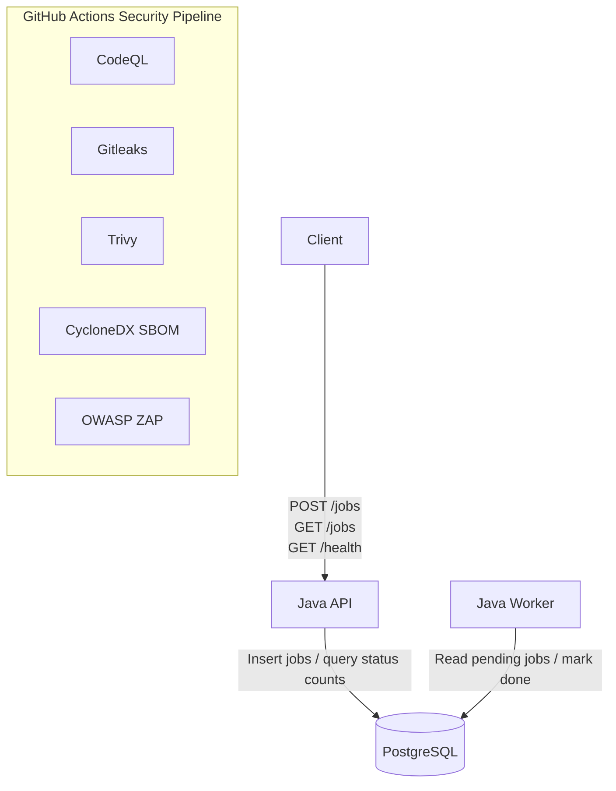
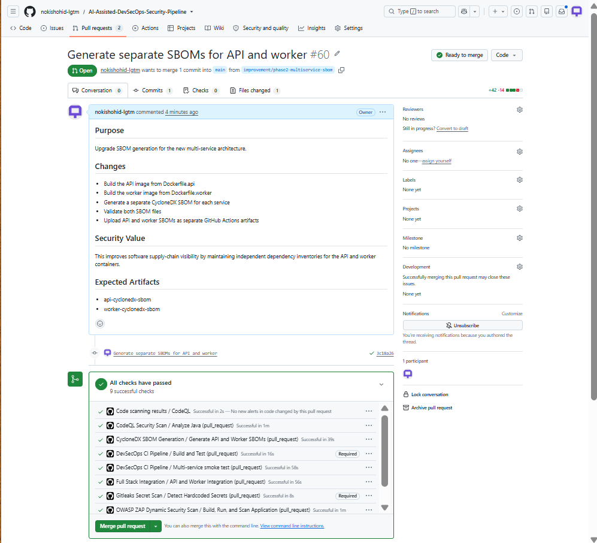
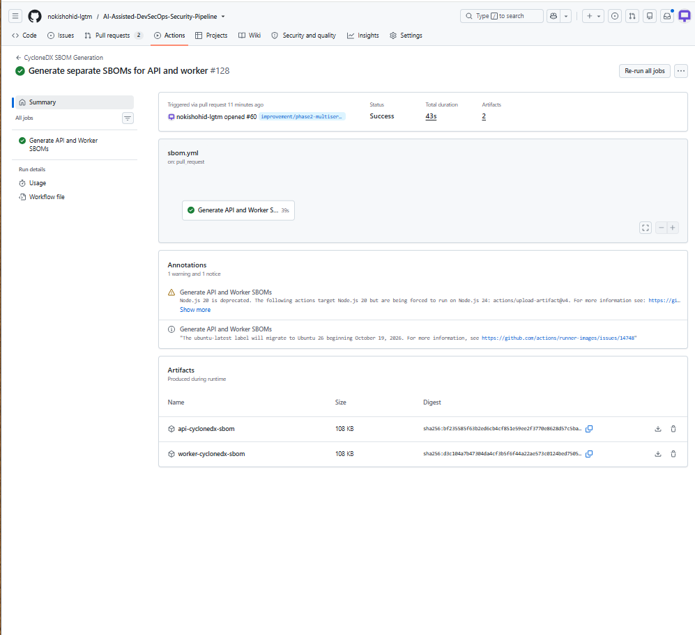
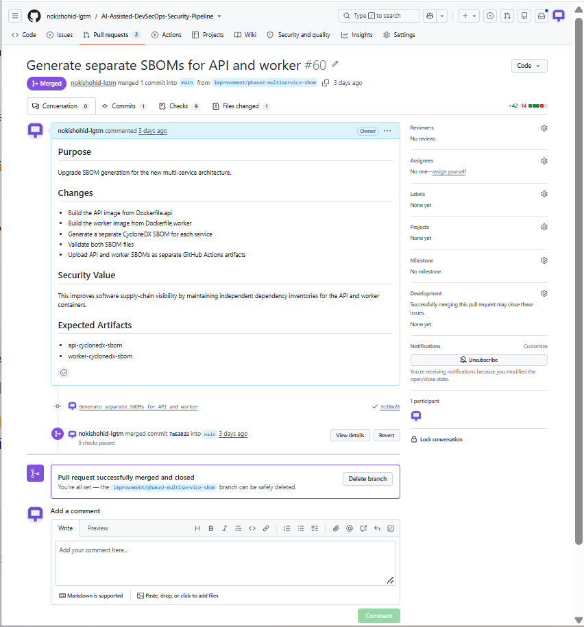
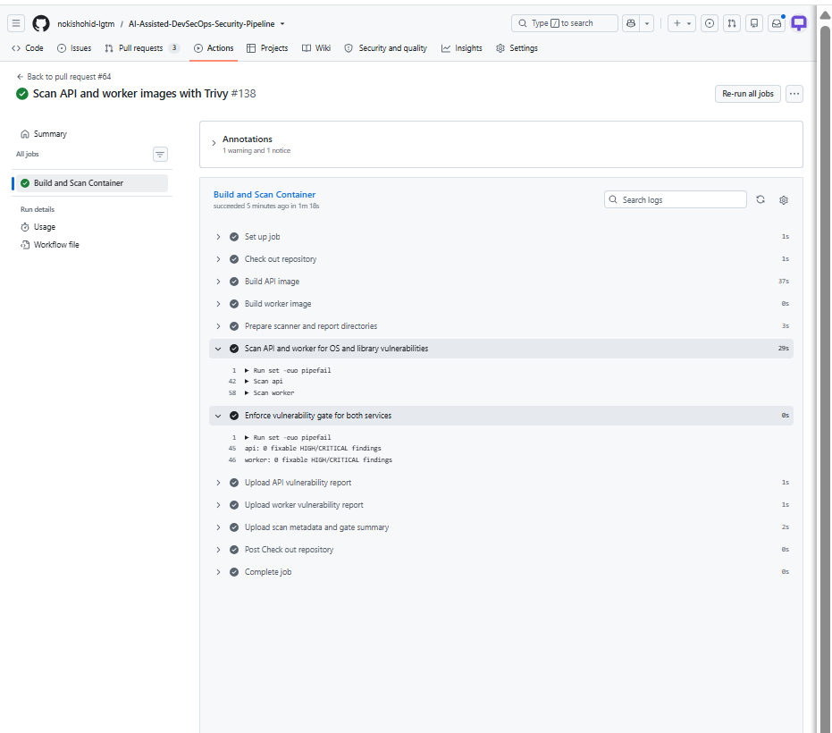
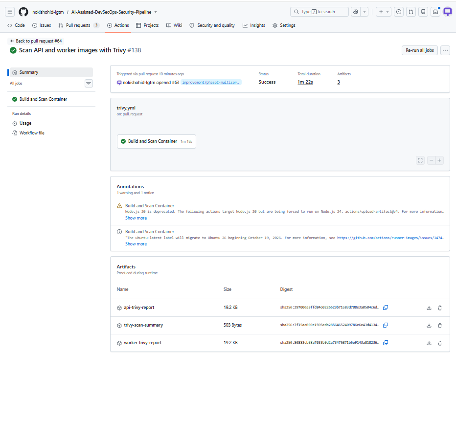
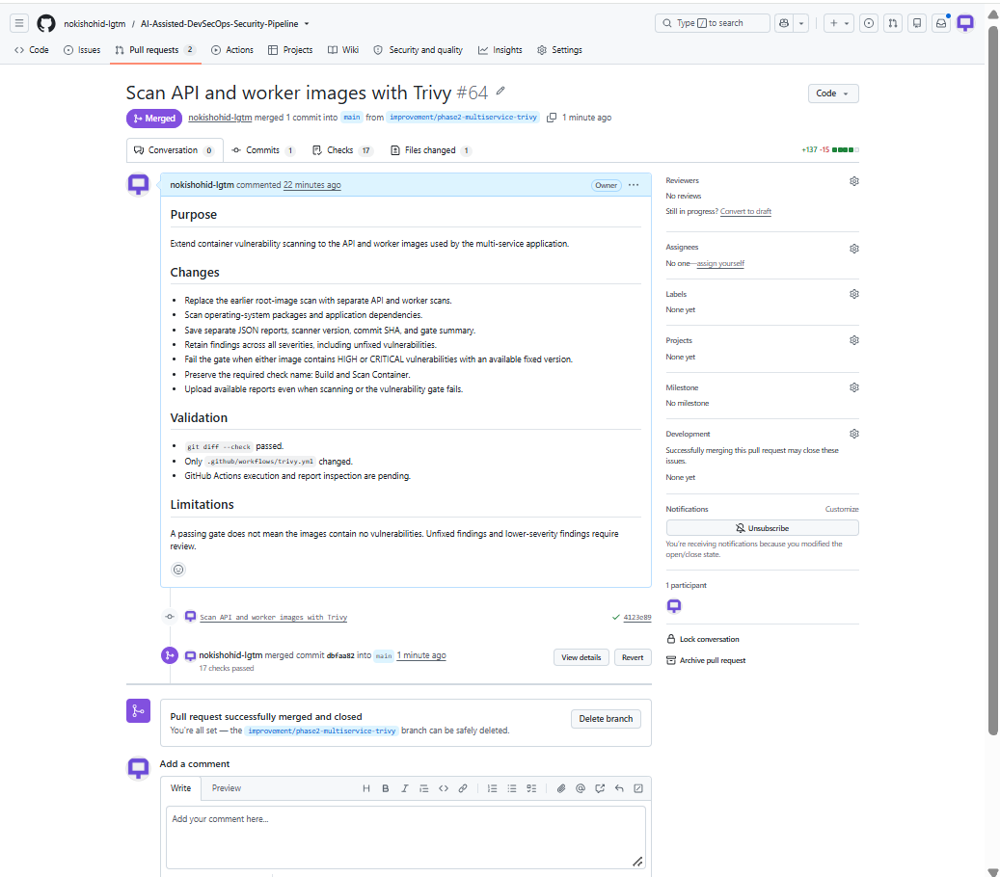
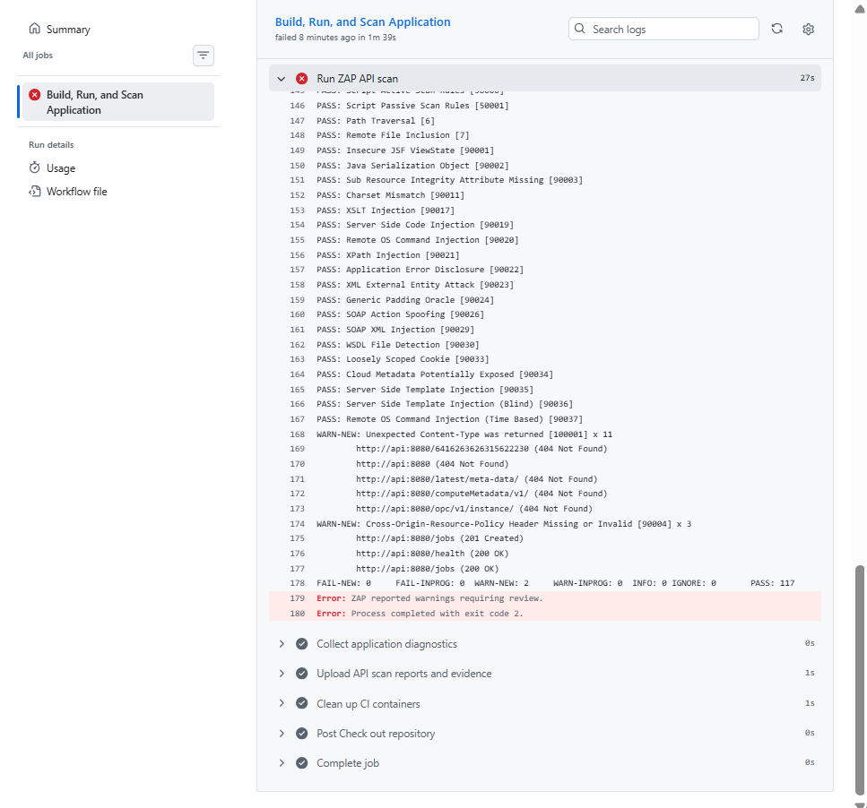
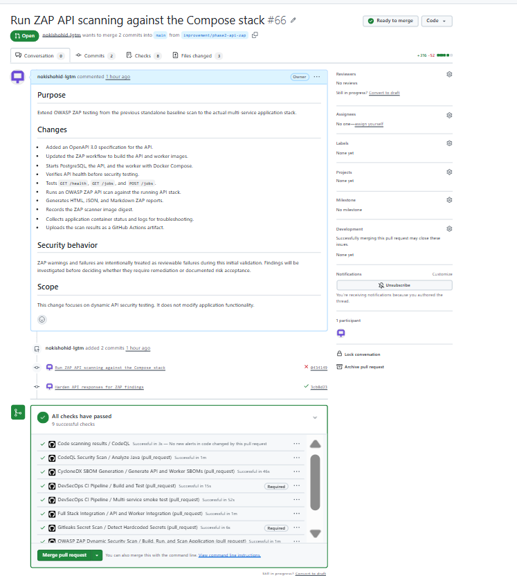
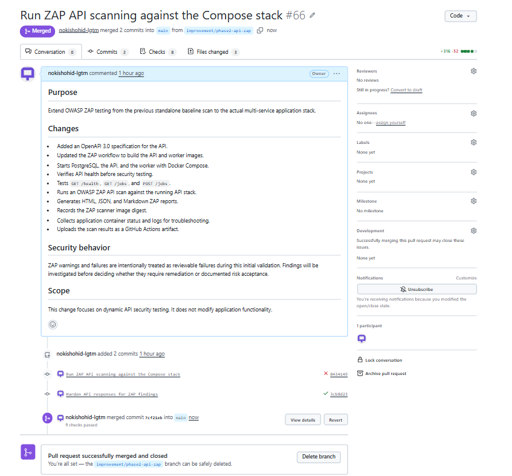

# AI-Assisted DevSecOps Security Pipeline

**Live Demo:** https://ai-assisted-devsecops-security-pipeline.onrender.com

**Pipeline Status:** 

## Executive Summary

This is an educational DevSecOps security project built around a Java API,
a background worker, PostgreSQL, Docker, and GitHub Actions.

The API accepts demonstration jobs and stores them in PostgreSQL. The worker
processes pending jobs and changes their status to `done`.

The project demonstrates how security controls can be integrated throughout a
CI/CD pipeline, including static analysis, secret scanning, container
vulnerability scanning, software bill of materials generation, dynamic API
security testing, container publishing, and image signing.

Phase 2 expanded the project from earlier single-container testing into a
multi-service application stack consisting of:

- Java API
- PostgreSQL
- Java worker

The multi-service stack is now exercised through integration testing, separate
API and worker SBOM generation, separate Trivy scanning, and OWASP ZAP API
security testing.

A separate AI-assisted triage workflow uses Groq to review CodeQL findings and
available source-code context. AI output is advisory and requires human review.

## Current Validation Scope

The current project validates the following areas:

| Area | Current validation |
|---|---|
| API | Accepts jobs and provides health and aggregate job-status responses |
| PostgreSQL | Stores submitted jobs and job status |
| Worker | Processes pending jobs and marks them `done` |
| Full-stack integration | Starts PostgreSQL, API, and worker and verifies an HTTP-submitted job is processed |
| SBOM coverage | Generates separate software inventories for API and worker images |
| Trivy coverage | Scans API and worker container images separately |
| ZAP coverage | Performs active API security testing against the running Compose stack |
| CodeQL | Performs static source-code security analysis |
| Gitleaks | Detects potential hardcoded secrets |
| AI triage | Advisory review of CodeQL findings; accuracy validation remains separate work |

Security scan results describe specific builds and test runs. They are not a
guarantee that the application is free of vulnerabilities.

Financial savings, faster remediation, and reduced incident rates have not
been measured in this educational lab.

## Feature Status

**Implemented and tested:** Functionality exists and has current validation.

**Implemented:** Functionality exists, but additional validation may still be
planned.

**Historical:** Evidence belongs to an earlier implementation or test scope.

**Planned:** Additional work remains.

| Capability | Status | Current coverage |
|---|---|---|
| Java API and PostgreSQL storage | Implemented and tested | Accepts jobs and returns aggregate status counts |
| Background worker | Implemented and tested | Processes pending jobs and changes status to `done` |
| API and worker image builds | Implemented and tested | Both service images are built in CI |
| Full container-stack integration | Implemented and tested | Starts PostgreSQL, API, and worker and validates job processing |
| Separate API and worker SBOMs | Implemented and tested | CycloneDX inventory is generated separately for each service image |
| API and worker Trivy scans | Implemented and tested | Service images are scanned separately and reports are retained |
| OWASP ZAP API scan | Implemented and tested | Active scan runs against the Compose API using an OpenAPI specification |
| CodeQL SAST | Implemented and tested | Source-code security analysis runs in GitHub Actions |
| Gitleaks secret scanning | Implemented and tested | Secret scanning runs as a CI security control |
| AI-assisted CodeQL triage | Implemented | Advisory Groq integration; accuracy validation remains outstanding |
| Earlier single-container security testing | Historical | Retained as earlier project evidence |
| Expanded trusted release validation | Planned | Dual-service release identity, inventory, and rollback validation remain future work |

## Run the Application Locally

Prerequisites:

- Git
- Docker Desktop using Linux containers
- PowerShell

From the project directory:

```powershell
docker compose up --build -d
docker compose ps
```

Check API health:

```powershell
Invoke-RestMethod -Uri "http://127.0.0.1:8081/health"
```

Submit a demonstration job:

```powershell
$job = Invoke-RestMethod `
    -Method Post `
    -Uri "http://127.0.0.1:8081/jobs" `
    -ContentType "application/json" `
    -Body '{"task":"portfolio-demo"}'

$job
```

Inspect job counts:

```powershell
Invoke-RestMethod -Uri "http://127.0.0.1:8081/jobs"
```

Inspect worker activity:

```powershell
docker compose logs --tail 30 worker
```

Clean up:

```powershell
docker compose down --volumes --remove-orphans
```

Use non-sensitive test data. The PostgreSQL credentials in the Compose
configuration are development defaults intended for the lab environment.

## Application Architecture



PostgreSQL coordinates the API and worker. There is no separate message broker.

The API inserts jobs into PostgreSQL. The worker reads pending jobs and marks
them complete.

The API currently provides:

```text
GET  /health
GET  /jobs
POST /jobs
```

A dedicated per-job status endpoint is not currently implemented.

## Project Goals

The project is designed to demonstrate practical DevSecOps security controls
through a reproducible lab environment.

The current goals include:

- Secure source-code analysis
- Secret detection
- Multi-service container builds
- Container vulnerability scanning
- Software inventory generation
- Dynamic API security testing
- CI/CD security gates
- Container hardening
- Secure image publishing and signing
- Evidence-based remediation
- Human-reviewed AI-assisted security triage

## Security Highlights

| Control | Implementation |
|---|---|
| Source security | CodeQL static application security testing |
| Secret detection | Gitleaks |
| Container vulnerability management | Trivy |
| Dynamic application testing | OWASP ZAP API scan |
| Software inventory | CycloneDX SBOM |
| Container hardening | Read-only filesystem, dropped capabilities, `no-new-privileges` |
| Supply-chain security | GHCR and Cosign |
| CI/CD security | GitHub Actions |
| Change control | Pull-request workflow and repository rules |
| AI assistance | Human-reviewed advisory triage |

➡️ [View the DevSecOps Pipeline Architecture](docs/architecture.md)

## What This Project Demonstrates

This project demonstrates practical experience with:

| Area | Demonstrated work |
|---|---|
| CI/CD | GitHub Actions workflows and pull-request validation |
| SAST | CodeQL security analysis |
| Secret scanning | Gitleaks |
| Container security | Docker hardening and Trivy |
| DAST | OWASP ZAP API security testing |
| SBOM | Separate API and worker CycloneDX inventories |
| Multi-service validation | API, PostgreSQL, and worker integration |
| Vulnerability remediation | Findings reviewed, remediated, and rescanned |
| Supply-chain security | GHCR and Cosign |
| Security documentation | Architecture, evidence, limitations, and workflow documentation |
| AI security assistance | Advisory CodeQL triage with human review |

### Skills Demonstrated

`DevSecOps` · `GitHub Actions` · `CI/CD` · `Java` · `Docker` ·
`PostgreSQL` · `CodeQL` · `Gitleaks` · `Trivy` · `OWASP ZAP` ·
`CycloneDX` · `Cosign` · `SBOM` · `SAST` · `DAST` ·
`Container Security` · `Supply Chain Security`

## Technology Stack

| Category | Technologies |
|---|---|
| Application | Java 17, Maven, JUnit |
| Database | PostgreSQL |
| Containers | Docker, Docker Compose |
| CI/CD | GitHub Actions |
| Static analysis | CodeQL |
| Secret scanning | Gitleaks |
| Vulnerability scanning | Trivy |
| Dynamic testing | OWASP ZAP |
| Software inventory | CycloneDX |
| Registry | GitHub Container Registry |
| Signing | Cosign |
| AI-assisted triage | Groq |

## Phase 2 Results

Phase 2 expanded security coverage to the multi-service application stack.

### Full-Stack Integration

The integration workflow starts:

```text
PostgreSQL
API
Worker
```

It verifies the API becomes healthy, submits a job through HTTP, and validates
that the application stack processes the job successfully.

This provides stronger validation than only checking database connectivity or
building container images.

### Separate API and Worker SBOMs

The project generates separate software inventories for the two service images.

This allows the components contained in the API and worker images to be
reviewed independently.

An SBOM identifies software components. It does not determine whether those
components are vulnerable.

### Separate API and Worker Trivy Coverage

Trivy scans the API and worker service images independently.

Separate reports make it possible to determine which service image contains a
finding instead of treating the complete project as one undifferentiated
container.

Scanner results represent the image state at the time of the scan and must
still be reviewed by a person.

### OWASP ZAP API Security Testing

The ZAP workflow now performs an active API scan against the temporary
multi-service Compose stack.

The workflow:

```text
Builds API and worker images
        ↓
Starts PostgreSQL, API, and worker
        ↓
Verifies API readiness
        ↓
Verifies GET /health
        ↓
Verifies GET /jobs
        ↓
Verifies POST /jobs
        ↓
Runs OWASP ZAP API scan
        ↓
Uploads reports and diagnostics
```

The scan uses:

```text
security/openapi.yaml
```

to describe the API endpoints.

### ZAP Finding and Remediation

The first Phase 2 API scan completed with:

```text
PASS: 117
FAIL: 0
WARN-NEW: 2
```

The two warning categories were:

```text
Unexpected Content-Type
Cross-Origin-Resource-Policy Header Missing or Invalid
```

Warnings intentionally caused the security workflow to fail so they could be
reviewed instead of silently ignored.

The API was then hardened with:

```text
Consistent JSON 404 responses
Cross-Origin-Resource-Policy: same-origin
```

The remediation was pushed to the same pull request, and the security workflow
was rerun successfully.

This demonstrates the complete security feedback cycle:

```text
Scan
  ↓
Finding
  ↓
Review
  ↓
Remediation
  ↓
Rescan
  ↓
Passing security check
```

## Automated Workflows

The repository contains the following GitHub Actions workflows:

| Workflow | Purpose and current coverage |
|---|---|
| `ci.yml` | Builds and tests the application and performs multi-service CI validation |
| `codeql.yml` | Performs Java source-code security analysis |
| `gitleaks.yml` | Detects potential hardcoded secrets |
| `trivy.yml` | Builds and scans API and worker service images |
| `zap.yml` | Starts the Compose stack and performs an OWASP ZAP API scan using OpenAPI |
| `sbom.yml` | Generates separate API and worker CycloneDX SBOMs |
| `container-release.yml` | Container publishing, signing, and verification workflow |
| `policy.yml` | Runs Conftest policy checks |
| `ai-triage.yml` | Provides advisory AI-assisted triage of CodeQL findings |

Dependabot is configured separately in:

```text
.github/dependabot.yml
```

## CI Coverage

The current multi-service validation starts the application stack rather than
only building its components.

The integration path includes:

```text
HTTP client
   ↓
API
   ↓
PostgreSQL
   ↑
Worker
```

The workflow verifies application readiness and validates job processing
through the running services.

## Vulnerability Coverage

The Phase 2 Trivy workflow scans the API and worker service images separately.

The resulting reports provide service-specific vulnerability evidence for
review.

A successful scanner run does not prove that a container is free from every
possible security issue. Findings also change as packages and vulnerability
databases are updated.

## Dynamic Security Coverage

OWASP ZAP runs against the actual API in the temporary CI Compose environment.

The OpenAPI specification currently includes:

```text
GET /health
GET /jobs
POST /jobs
```

The initial warning-producing run and subsequent successful remediation run are
both retained as evidence.

## Policy Coverage

Conftest policy validation remains a separate control.

Policy coverage should not be confused with Trivy vulnerability scanning,
CodeQL analysis, or ZAP testing. Each control evaluates a different part of
the project.

The repository should only claim enforcement for policies that are actually
connected to the current workflow commands.

## Action References and Merge Requirements

GitHub Actions currently use versioned action references such as:

```text
@v4
@v5
```

They are not uniformly pinned to full commit SHAs.

Pull-request evidence shows security checks running successfully before merge.

Repository rules and required-check settings are configuration outside the
source tree and should be confirmed in repository settings before making
claims about which checks are currently mandatory.

## Project Evidence

### Phase 2 — Multi-Service SBOM Evidence

Successful API and worker SBOM generation:



Separate API and worker SBOM artifacts:



SBOM implementation pull request merged:



### Phase 2 — Multi-Service Trivy Evidence

Successful API and worker Trivy scanning:



Separate Trivy artifacts:



Trivy evidence pull request merged:



### Phase 2 — OWASP ZAP API Evidence

Initial API scan showing warnings requiring review:



Successful security checks after remediation:



ZAP API implementation pull request successfully merged:



### Earlier Multi-Service Evidence

Local Docker Compose status:


Local API inspection:


Worker activity:


### Earlier CI Evidence

Historical pull-request checks:


Historical database tests and image builds:


### Architecture Decision Records

Architecture decision records document important design choices used throughout
the project.


## Container Hardening

The API and worker Compose services use multiple runtime restrictions:

| Control | Configuration |
|---|---|
| Root filesystem | Read-only |
| Temporary storage | Writable `/tmp` only |
| `/tmp` execution | `noexec` |
| `/tmp` privilege bits | `nosuid` |
| Linux capabilities | All dropped |
| Privilege escalation | `no-new-privileges` |
| Database startup | PostgreSQL health-check dependency |
| API host exposure | Bound to `127.0.0.1:8081` |
| PostgreSQL exposure | No host port published |

These runtime controls reduce container privileges but do not replace
application security testing or vulnerability management.

## AI Data Sharing

The AI-assisted triage feature is separate from the primary CI security
controls.

When findings are present and the triage script executes successfully, it may
send up to 10 CodeQL findings and available surrounding source-code context to
Groq.

Results may be posted to a pull request when a pull-request number is
available. Otherwise, results are printed to workflow output.

A run containing no findings does not validate classification accuracy.

AI output does not automatically:

```text
Fix code
Dismiss findings
Approve risk
Merge changes
```

Human review remains required.

## Current Limitations

This is an educational lab rather than a production environment.

Important limitations include:

| Limitation | Current state |
|---|---|
| AI triage accuracy | Not yet formally evaluated against a labeled test set |
| Trusted dual-image releases | Additional release validation remains planned |
| Production secrets management | Development credentials are used in the local Compose lab |
| Kubernetes policy coverage | Must be verified separately from Dockerfile policy checks |
| Resource limits | Not comprehensively defined for every service |
| PostgreSQL hardening | Not equivalent to the API and worker runtime restrictions |
| Security guarantees | Scanner success does not prove absence of vulnerabilities |

## Lessons Learned

Security controls are most useful when their results are reviewed rather than
treated as simple green/red badges.

The project demonstrated several practical lessons:

- Security findings require investigation before remediation decisions.
- Separate service artifacts improve traceability.
- An SBOM is a software inventory, not a vulnerability scan.
- Vulnerability scanning and DAST test different security layers.
- ZAP warnings can expose response-hardening opportunities.
- A failing security check can be useful evidence when it correctly blocks a
  finding that still requires review.
- Remediation should be followed by a new scan.
- Container signatures establish identity and integrity but do not prove that
  an image is vulnerability-free.
- Pull requests create a reviewable history of security changes.
- Evidence should be linked to the exact implementation and test scope it
  represents.

## Project Roadmap

### Phase 1 — Architecture and Accuracy

Status: **Completed**

The project documentation and architecture were aligned with the implemented
API, PostgreSQL, worker, and CI structure.

### Phase 2 — Service Security Coverage

Status: **Completed**

Phase 2 added:

```text
Full-stack integration validation
Separate API and worker SBOMs
Separate API and worker Trivy scanning
Active OWASP ZAP API testing
ZAP finding remediation and validation
Organized Phase 2 evidence
```

### Phase 3 — Security Gate Validation

Status: **Next**

The next phase will intentionally exercise security gates using controlled,
harmless test conditions.

The objective is to demonstrate:

```text
Expected failure
      ↓
Security control detects condition
      ↓
Merge is blocked
      ↓
Condition is remediated
      ↓
Security control passes
```

### Phase 4 — Trusted Releases

Status: **Planned**

Future work will validate image identity, digests, SBOM association, signature
verification, and rollback procedures for released service images.

### Phase 5 — AI-Assisted Triage Validation

Status: **Planned**

AI recommendations will be evaluated using representative findings and human
review rather than assuming successful execution proves accuracy.

### SOC / Splunk Work

SOC and Splunk development are intentionally maintained as a separate
cybersecurity portfolio track.

This keeps the DevSecOps repository focused on:

```text
Secure CI/CD
Application security
Container security
Software supply-chain security
Security gates
Release security
```

while dedicated SOC projects can focus on:

```text
SIEM
SPL
Log analysis
Detection engineering
Alert triage
MITRE ATT&CK
Incident investigation
```

### Final Verification and Portfolio Packaging

Status: **Planned**

The final project stage will validate reproducibility, documentation accuracy,
evidence organization, threat modeling, and portfolio presentation.

## Responsible Use

This project is an educational security lab.

Run security testing only against applications, infrastructure, and systems
that you own or have explicit authorization to test.

Do not use real credentials, production secrets, customer data, or other
sensitive information in demonstration security tests.

<!-- trigger CodeQL for AI triage test -->
