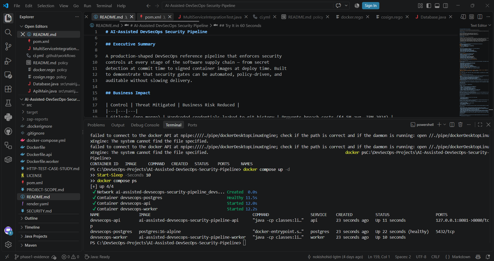
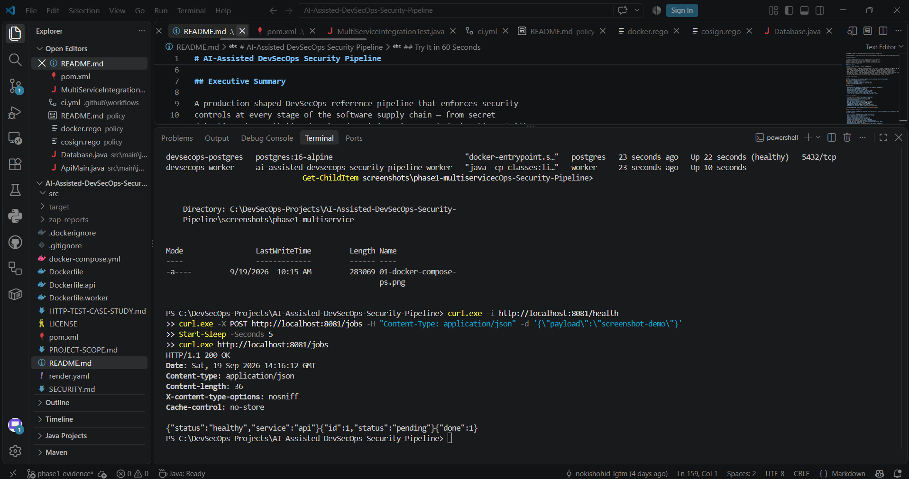
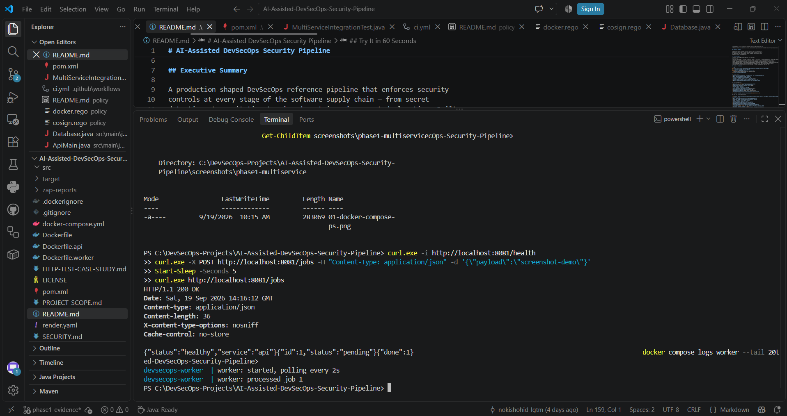
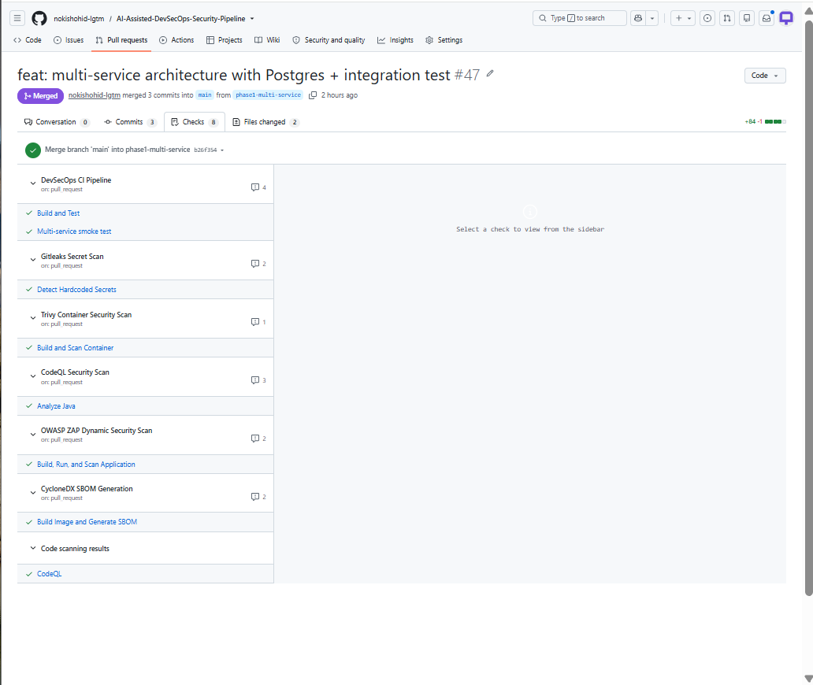
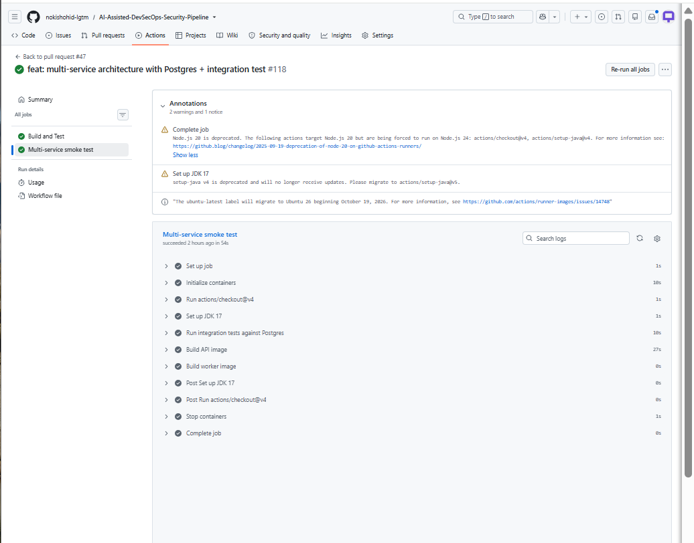
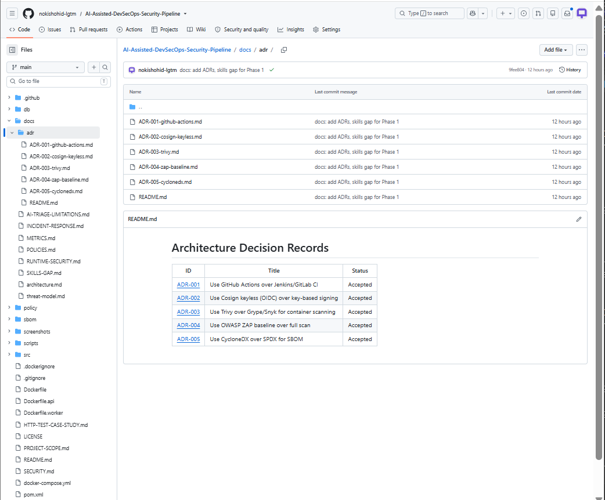

# AI-Assisted DevSecOps Security Pipeline

**Live Demo:** https://ai-assisted-devsecops-security-pipeline.onrender.com

**Pipeline Status:** 

## Executive Summary

A production-shaped DevSecOps reference pipeline that enforces security
controls at every stage of the software supply chain — from secret
detection at commit time to signed container images at deploy time. Built
to demonstrate that security gates can be automated, policy-driven, and
auditable without slowing delivery.

## Business Impact

| Control | Threat Mitigated | Business Risk Reduced |
|---|---|---|
| Gitleaks (pre-merge) | Hardcoded credentials leaked to git history | Prevents breach costs ($4.5M avg, IBM 2024) |
| CodeQL SAST | Injection, XSS, deserialization flaws | Shifts fix cost from prod (100x) to PR (1x) |
| Trivy + 30-day policy | Known-exploited CVEs in runtime image | Blocks supply-chain compromise vector |
| OWASP ZAP DAST | Runtime misconfig, missing security headers | Catches what SAST structurally cannot |
| Cosign keyless signing | Image tampering between build and deploy | Proves provenance; enables admission control |
| CycloneDX SBOM | Unknown transitive dependencies | Enables 24-hour CVE response (log4shell-class) |
| OPA/Conftest policies | Policy drift across teams | Encodes compliance as code, not PDFs |

## Try It in 60 Seconds

```bash
git clone https://github.com/nokishohid-lgtm/AI-Assisted-DevSecOps-Security-Pipeline.git
cd AI-Assisted-DevSecOps-Security-Pipeline
docker build -t devsecops-local .
docker run -d -p 8081:8080 --read-only --cap-drop ALL \
  --security-opt no-new-privileges:true devsecops-local
curl http://localhost:8081/health
```

## Project Goals

- Detect source-code weaknesses, exposed secrets, and vulnerable dependencies.
- Build and scan a hardened Docker container.
- Test the running application with OWASP ZAP.
- Generate a CycloneDX software bill of materials (SBOM).
- Publish container images to GitHub Container Registry.
- Sign and verify container images using Cosign and GitHub OIDC.
- Protect the main branch with pull requests and required CI checks.

## Security Highlights

- Protected `main` branch with pull-request-only changes
- Required CI security checks enforced before merge
- CodeQL static application security testing (SAST)
- Gitleaks secret detection
- Trivy container vulnerability scanning
- OWASP ZAP dynamic application security testing (DAST)
- CycloneDX software bill of materials (SBOM) generation
- Cosign keyless container image signing using OIDC
- GitHub Container Registry (GHCR) secure image publishing
- Main-branch-only container releases with concurrency protection

➡️ [View the DevSecOps Pipeline Architecture](docs/architecture.md)

## What This Project Demonstrates

This project demonstrates practical DevSecOps skills across secure software development, CI/CD automation, application security testing, and container security.

- Built and tested a Java application through GitHub Actions
- Integrated CodeQL for static application security testing
- Added Gitleaks to detect exposed secrets
- Scanned container images with Trivy
- Performed dynamic security testing with OWASP ZAP
- Generated a CycloneDX software bill of materials
- Signed container images with Cosign using GitHub OIDC
- Published signed container images to GitHub Container Registry
- Protected the `main` branch with pull requests and required security checks
- Restricted container releases to `main`
- Documented security evidence, validation results, and pipeline architecture

### Skills Demonstrated

`DevSecOps` · `GitHub Actions` · `CI/CD` · `Java` · `Docker` · `CodeQL` · `Gitleaks` · `Trivy` · `OWASP ZAP` · `CycloneDX` · `Cosign` · `SBOM` · `SAST` · `DAST` · `Container Security` · `Supply Chain Security`

## Technology Stack

Java 17, Maven, JUnit, Docker, GitHub Actions, CodeQL, Gitleaks, Dependabot, Trivy, OWASP ZAP, Syft, CycloneDX, GHCR, and Cosign.

## Results and Evidence

Results observed during the documented project runs:

- Maven: 4 automated HTTP tests passed, covering application status, health status, JSON content type, and security headers on both endpoints.
- Trivy: zero fixable HIGH or CRITICAL operating-system vulnerabilities after remediation.
- OWASP ZAP: zero failed checks, 66 passed checks, and one remaining warning.
- Syft: the locally generated CycloneDX SBOM contained 1,295 components.
- GitHub Container Registry: container image published successfully.
- Cosign: keyless image signing and signature verification completed successfully.
- GitHub ruleset: pull requests, up-to-date branches, and three checks are required for main: Build and Test, Detect Hardcoded Secrets, and Build and Scan Container.

The remaining ZAP warning concerned non-storable content, consistent with the application's intentional Cache-Control: no-store setting.

These results describe specific scans, not a guarantee that the application is free of vulnerabilities. Component counts and findings may change between builds.

## Automated Workflows

Workflow files are stored in `.github/workflows/`.

| Workflow | Purpose |
|---|---|
| `ci.yml` | Build the Java application and run automated tests |
| `codeql.yml` | Analyze source code for security weaknesses |
| `gitleaks.yml` | Scan for exposed secrets |
| `trivy.yml` | Scan the container image for vulnerabilities |
| `zap.yml` | Run a ZAP baseline scan against the application |
| `sbom.yml` | Generate and upload a CycloneDX SBOM |
| `container-release.yml` | Scan, publish, sign, and verify the container image |
| `policy.yml` | Run OPA/Conftest policy checks on Dockerfile and manifests |

Dependabot configuration is stored in `.github/dependabot.yml`.

These workflows run separately. The main-branch ruleset requires Build and Test, Detect Hardcoded Secrets, and Build and Scan Container. Other security workflows run but are not required merge checks.

The Trivy gate blocks fixable HIGH or CRITICAL operating-system vulnerabilities. The container-release workflow independently repeats this vulnerability check before publishing.

## Project Evidence

### Multi-Service Architecture (Phase 1)

The API and Worker services, backed by Postgres, run as a hardened three-container stack:



End-to-end test — API health check, job enqueue, worker pickup:



Worker processing jobs from the queue:



### CI Enforcement

All checks pass on the multi-service PR, including the new `multi-service-smoke` job:



The smoke test proves the whole stack works in CI — spins up Postgres, runs the integration test, and builds both images:



### Architecture Decision Records

Five ADRs document the key design choices (GitHub Actions, Cosign keyless, Trivy, ZAP baseline, CycloneDX):



### Earlier Evidence

- Cosign container signing and verification
- Main-branch protection ruleset
- Trivy container scan workflow
- OWASP ZAP scan workflow
- CycloneDX SBOM generation workflow
- HTTP test troubleshooting case study
- Required checks block merging after an intentional test failure

## Container Hardening

The Docker build uses:

- A multi-stage build separating build tools from the runtime image.
- An Alpine-based Java runtime.
- Updated operating-system packages.
- A non-root application user.

Both `Dockerfile.api` and `Dockerfile.worker` copy runtime dependencies (including the Postgres JDBC driver) into `lib/` and put them on the classpath, so the built images run without a Maven repository.

The ZAP workflow and docker-compose start the application containers with additional runtime restrictions:

- A read-only root filesystem.
- Temporary writable storage at `/tmp` (noexec, nosuid).
- All Linux capabilities dropped.
- The `no-new-privileges` security option.
- CPU and memory limits.

Runtime restrictions must be supplied when starting the container; pulling the published image does not automatically apply them.

## Lessons Learned

- Security scans need review: a successful workflow does not mean every security concern is resolved.
- Updating container operating-system packages addressed the fixable vulnerabilities identified during this project.
- ZAP report generation initially failed because the mounted report directory was not writable by the scanner.
- Checking artifact-upload logs confirmed that reports were actually saved.
- An SBOM records software components; it is not itself a vulnerability scan.
- Container signatures help verify image origin and integrity, but do not prove that an image is vulnerability-free.
- Branch protection moves changes through pull requests and required checks instead of direct pushes to main.
- Copying runtime dependencies into the container image is required when running a plain Java `-cp` entrypoint — otherwise the JDBC driver is missing at runtime.
- Multi-service integration tests should run only when a database is available, using an env-var guard (`RUN_DB_TESTS=true`) so `mvn test` stays green locally.

## Responsible Use

This project is an educational lab. Run security scans only against applications and infrastructure you own or have explicit permission to test.

<!-- trigger CodeQL for AI triage test -->
