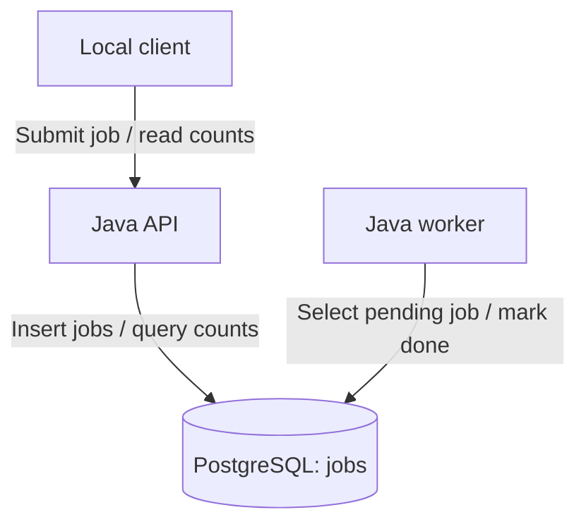

# Architecture — AI-Assisted DevSecOps Security Pipeline

## Purpose and Scope

This educational application consists of a Java API, a background
worker, and PostgreSQL. The worker simulates asynchronous processing
by changing stored jobs from pending to done.

The repository also contains an earlier single-container HTTP
application. Historical scans and release evidence for that application
do not establish equivalent coverage for the API and worker images.

## Application Architecture

PostgreSQL coordinates the services. There is no separate message broker
in the current application.

### Components

| Component | Source | Responsibility |
|---|---|---|
| API | `src/main/java/com/nokishohid/devsecops/api/ApiMain.java` | Accept jobs and return aggregate status counts |
| Worker | `src/main/java/com/nokishohid/devsecops/worker/WorkerMain.java` | Select pending jobs and update their status |
| Database helper | `src/main/java/com/nokishohid/devsecops/Database.java` | JDBC connections, schema creation, insertion, and counts |
| Initial schema | `db/init.sql` | Define the jobs table and status index |
| Local stack | `docker-compose.yml` | Configure PostgreSQL and build the two application services |

### Job Lifecycle

1. A client submits a request to `POST /jobs`.
2. The API stores its body as text in PostgreSQL.
3. The API returns a job ID and pending status.
4. The worker selects a pending job inside a database transaction.
5. The worker marks it done and records processing timestamps.
6. The worker commits the transaction.

The worker uses `FOR UPDATE SKIP LOCKED`. It waits two seconds when
no job is processed. It does not transform or otherwise process the
payload beyond updating status and timestamps.

Multiple-worker behavior has not been validated by the reviewed evidence.

### API Behavior

| Request | Current behavior |
|---|---|
| `GET /health` | Returns a static API health response |
| `POST /jobs` | Stores the request body and returns an ID with pending status |
| `GET /jobs` | Returns counts grouped by status |

The health response does not check database readiness. Status groups
without rows may be absent from the counts response.

There is no dedicated per-job status endpoint. The handler uses prefix
routing without strict exact-path validation. Request bodies are not
validated as JSON, and there is no explicit request-size limit.

### Database

The jobs table stores:

- Job ID.
- Payload text.
- Status, initially pending.
- Creation timestamp.
- Pickup and completion timestamps.

The PostgreSQL initialization script creates the schema for a new
database. The API and worker also call the database helper's schema
creation method during startup.

## Local Runtime

The Compose configuration defines three services on a shared bridge network.

| Service | Build or image | Host exposure |
|---|---|---|
| API | `Dockerfile.api` | `127.0.0.1:8081` maps to container port 8080 |
| Worker | `Dockerfile.worker` | No published port |
| PostgreSQL | `postgres:16-alpine` | No published host port |

Both application services wait for PostgreSQL's configured health check
before startup. This does not establish ongoing application readiness.

### Configured Restrictions

The API and worker have:

- Read-only root filesystems.
- Temporary `/tmp` storage with `noexec` and `nosuid`.
- All Linux capabilities dropped.
- `no-new-privileges` enabled.

These restrictions are not configured identically for PostgreSQL.
CPU and memory limits are not present in the reviewed Compose file.

The database credentials are development defaults. Use non-sensitive
lab data. Durable database storage and recovery across container
recreation require separate configuration and validation.

## Continuous Integration

The `ci.yml` workflow runs on pushes and pull requests to main,
and supports manual execution.

| Job | Configured actions | Coverage limit |
|---|---|---|
| Build and Test | Run Maven clean verify | Database test is skipped unless its environment guard is enabled |
| Multi-service smoke test | Start PostgreSQL, enable database tests, build API and worker images | Does not start the application images |

### Database Integration Test

`MultiServiceIntegrationTest` runs when `RUN_DB_TESTS=true`.

It checks:

- Database connectivity.
- Schema creation.
- Job insertion and a positive returned ID.
- Aggregate status counts.

It does not call the API, execute the worker, or verify completion
of the specific inserted job.

Building both images is implemented. Full container-stack integration
testing remains planned.

## Security Workflow Coverage

The repository contains separate workflows. They should not be
represented as one sequential pipeline without verified dependencies.

| Workflow | Role |
|---|---|
| `ci.yml` | Maven tests, database integration test, and application image builds |
| `codeql.yml` | Source-code security analysis |
| `gitleaks.yml` | Secret scanning |
| `trivy.yml` | Root Dockerfile image vulnerability scan |
| `zap.yml` | ZAP baseline scanning |
| `sbom.yml` | Software inventory generation |
| `container-release.yml` | Container release workflow |
| `policy.yml` | Conftest command against the root Dockerfile |
| `ai-triage.yml` | Advisory analysis of CodeQL findings |

### Verified Configuration Boundaries

- The reviewed Trivy command scans fixable HIGH/CRITICAL OS
  vulnerabilities in the root Dockerfile image.
- It excludes application dependency scanning.
- It does not scan the separate API and worker images.
- The reviewed Conftest command tests the root Dockerfile, even
  though Kubernetes changes can trigger its workflow.
- The reviewed workflows do not feed a Trivy report into
  `policy/trivy.rego`.
- A 30-day vulnerability-age rule is not established as enforced.
- Reviewed action references use version tags rather than uniform
  full commit-SHA pinning.

Historical branch-protection evidence records three required checks.
Current merge requirements must be confirmed in repository settings.

## AI Triage and External Data Flow

The AI triage workflow is configured to react to successful completion
of a workflow named `CodeQL Security Scan`, or manual invocation.

Its script reads a CodeQL SARIF artifact and, when findings are present,
can send up to 10 findings and available surrounding source-code context
to Groq.

The script requests advisory classifications and fix suggestions.
It posts a summary to a pull request when a PR number is available;
otherwise, it prints the summary to workflow output.

### Limitations

- A no-findings run does not exercise the model request.
- Classification accuracy requires independent evaluation.
- The script does not automatically fix code or dismiss findings.
- Source context must match the scanned commit; the workflow does
  not explicitly select that commit for checkout.
- The script does not implement general sensitive-data redaction
  or repository-bound validation of SARIF file paths.
- Manual execution requires a valid artifact source; the workflow's
  run ID expression is derived from a workflow-run event.

AI triage is separate from the API and worker runtime. The shared
application code does not invoke an AI model.

## Trust Boundaries and Data Handling

| Boundary | Data or interaction |
|---|---|
| Client to API | Job payload submission and status-count requests |
| API and worker to PostgreSQL | Payload storage and job status updates |
| Repository to CI runner | Source checkout, builds, and tests |
| AI triage to Groq | Finding details and available source-code context |
| Release tooling to external services | Historical GHCR publishing and Sigstore signing interactions |

The application accepts arbitrary payload text and does not prevent
personal information from being stored. Scanning data does not all
remain inside GitHub Actions because AI triage can send data to Groq.

Artifact retention must be established from workflow configuration
and repository settings. No project-wide retention period is assumed.

## Deployment Evidence

Render configuration and Kubernetes manifests exist in the repository.
Their presence alone does not prove that the complete stack is deployed
or that runtime admission policies are enforced.

Historical container publishing and signing results must remain tied
to their original image, commit, and workflow run. Signature verification
during release does not establish verification at deployment admission.

## Planned Phase 2 Architecture Validation

- Build both service images and record their identities.
- Scan both images for OS and application dependency vulnerabilities.
- Start the API, worker, and PostgreSQL together in CI.
- Submit a job through HTTP.
- Verify that the same job reaches done within a bounded timeout.
- Retain service logs and test results.
- Run API-specific web security checks.
- Generate a separate SBOM for each image.

Completion requires passing evidence from the running stack and
security reports tied to both service images.

## Related Documentation

- [Project README](../README.md)
- [Project scope](../PROJECT-SCOPE.md)
- [Policy documentation](POLICIES.md)
- [Architecture decision records](adr/README.md)
- [Historical CodeQL repair evidence](../screenshots/phase2-codeql-repair/README.md)